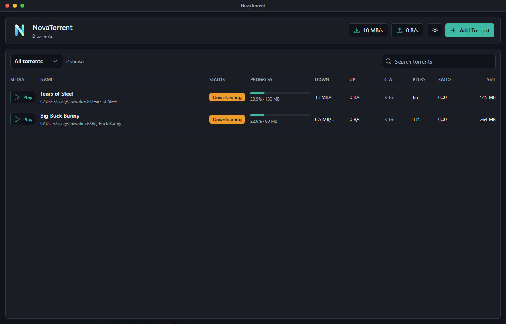

<p align="center">
  
</p>

<h1 align="center">NovaTorrent</h1>

<p align="center">
  
</p>


<p align="center">
  A fast, modern BitTorrent client for Windows with built-in media streaming.
</p>

<p align="center">
  <a href="https://github.com/rustybalboadev/NovaTorrent/releases/latest">Download</a>
  ·
  <a href="#features">Features</a>
  ·
  <a href="#run-from-source">Run from source</a>
  ·
  <a href="#build-a-windows-release">Build</a>
</p>

<p align="center">
  NovaTorrent is a Windows BitTorrent client built with Rust, Tauri, React, and Next.js. It downloads torrents from magnet links or .torrent files, supports resumable downloads and per-file controls, and can play media while it downloads.
</p>

## Download and install

Download the current Windows release from [GitHub Releases](https://github.com/rustybalboadev/NovaTorrent/releases/latest).

1. Expand **Assets** on the latest release.
2. Download a Windows x64 installer:
   - **NovaTorrent_*_x64-setup.exe** — recommended for most users.
   - **NovaTorrent_*_x64_en-US.msi** — intended for managed installation.

NovaTorrent is not currently code-signed, so Windows may show a SmartScreen warning. Only install builds downloaded from this repository, or build the application from source.

## Features

- Add magnet links and `.torrent` files with a complete file preview before downloading.
- Discover peers through HTTP, HTTPS, and UDP trackers, DHT, peer exchange, local peer discovery, and magnet peer hints.
- Download from multiple peers concurrently with adaptive request pipelining, rarest-first selection, endgame requests, connection reuse, and stalled-peer recovery.
- Verify every completed piece against the torrent's SHA-1 piece hashes.
- Resume verified partial downloads after pausing, closing, or restarting NovaTorrent.
- Set per-torrent connection limits, bandwidth limits, sequential mode, seed ratios, file selection, and per-file priority.
- Inspect torrent state, peers, trackers, web seeds, individual file progress, piece availability, options, and filterable logs.
- Stream supported media before the torrent finishes, with seek-aware piece priority, remembered playback positions, a playable-file queue, and subtitle selection.
- Recheck existing files and preserve safe, predictable download folder layouts.
- Seed completed torrents through a bounded inbound listener with fair upload-slot rotation.
- Open `magnet:` links and `.torrent` files directly from Windows.

## Run from source

### Development requirements

Building NovaTorrent requires:

- 64-bit Windows 10 or Windows 11.
- [Git](https://git-scm.com/download/win).
- [Node.js](https://nodejs.org/) 20.9 or newer. npm is included with Node.js.
- [Rust](https://www.rust-lang.org/tools/install) 1.77.2 or newer using the MSVC toolchain.
- [Microsoft C++ Build Tools](https://visualstudio.microsoft.com/visual-cpp-build-tools/) with **Desktop development with C++** selected.
- [Microsoft Edge WebView2 Runtime](https://developer.microsoft.com/microsoft-edge/webview2/).

The official [Tauri prerequisites guide](https://v2.tauri.app/start/prerequisites/) contains detailed Windows setup instructions.

### Clone and start NovaTorrent

Open PowerShell and run:

```powershell
git clone https://github.com/rustybalboadev/NovaTorrent.git
Set-Location NovaTorrent
npm ci
npm run tauri:dev
```

`npm ci` installs the exact dependency versions recorded in `package-lock.json`. The first Tauri launch can take several minutes because Rust dependencies must be compiled.

## Build a Windows release

Install all [development requirements](#development-requirements), then run:

```powershell
npm ci
npm run tauri:build
```

The build creates:

```text
src-tauri/target/release/novatorrent.exe
src-tauri/target/release/bundle/nsis/NovaTorrent_<version>_x64-setup.exe
src-tauri/target/release/bundle/msi/NovaTorrent_<version>_x64_en-US.msi
```

## License

NovaTorrent is released under the [MIT License](LICENSE).
